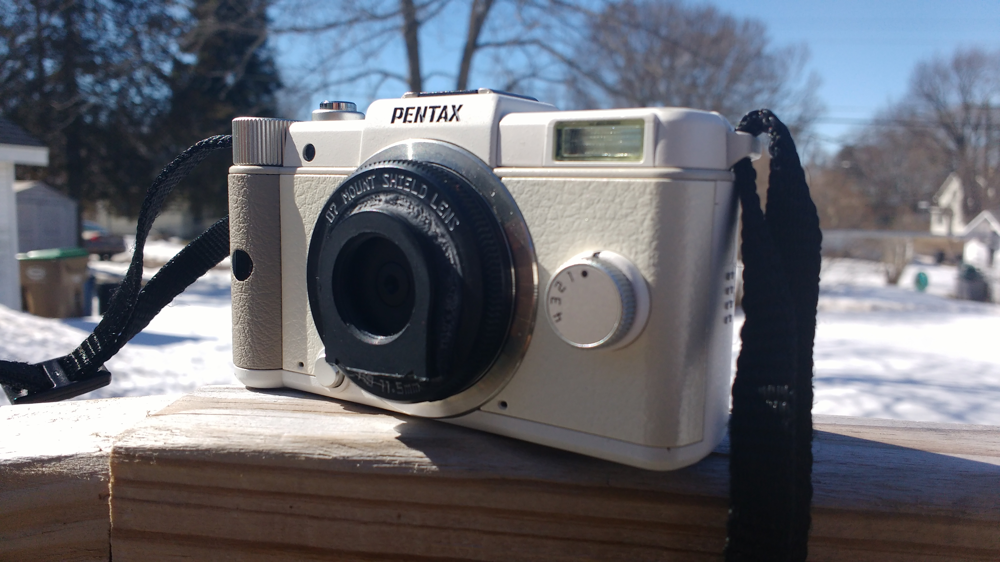
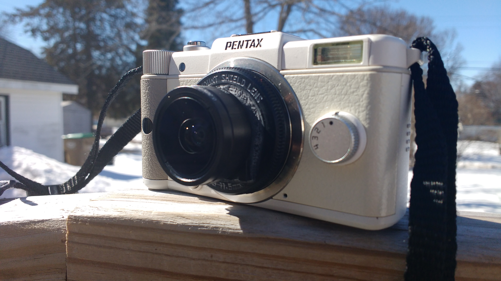
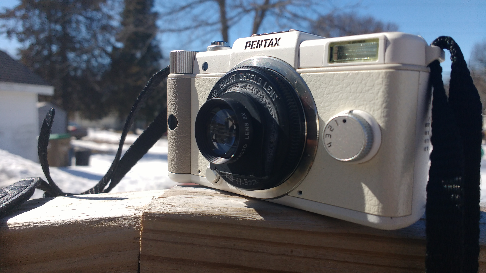
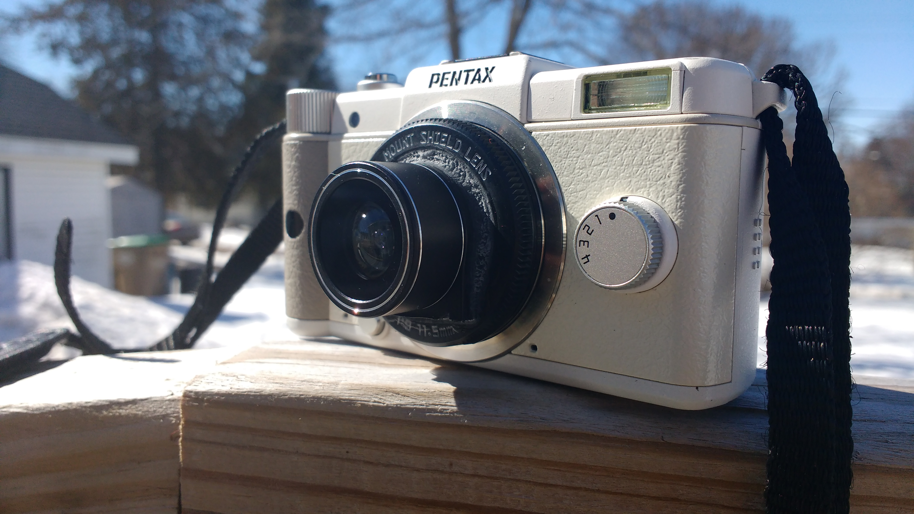
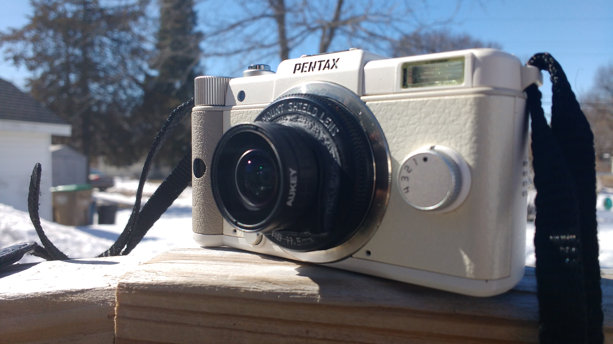
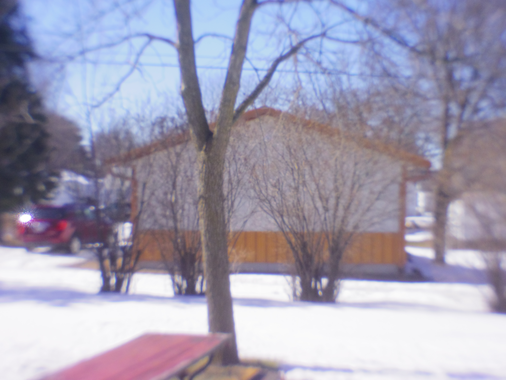
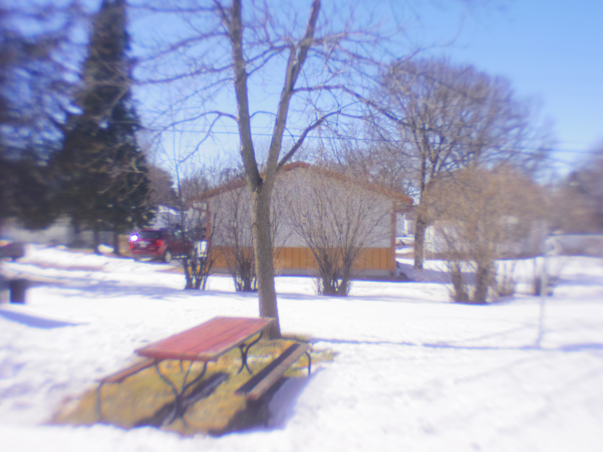
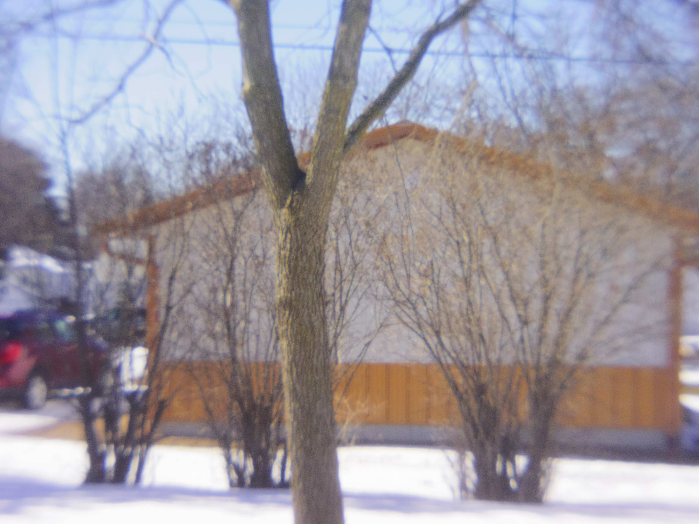
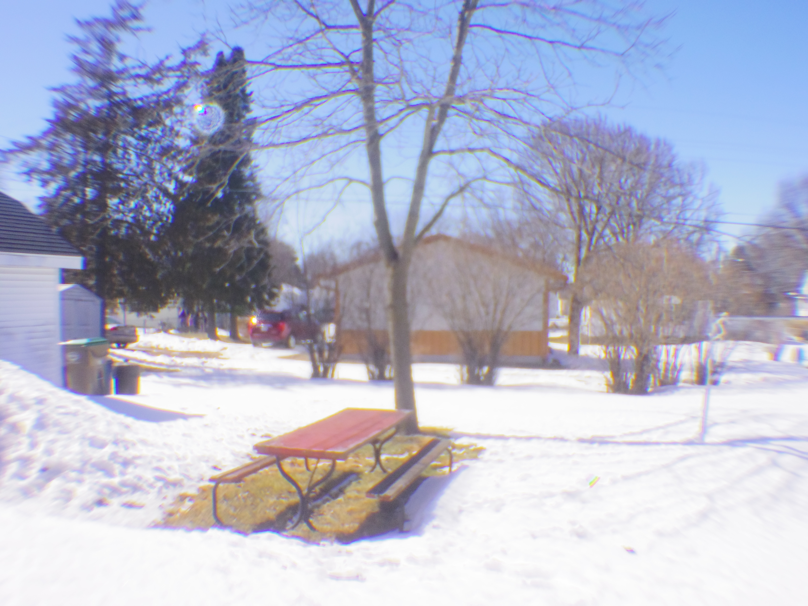

# shield-mount-lens-atachments

So the idea was to give the shield-mount lense a wider field of view by supergluing on the recieving threads of a cell-phone clip-on lens. I was then able to screw on different converter lens. The results were not good but they wern't really worse than the 07 lens. The nice thing is that all these converter lenses are tiny and the 07 lens is cheap so why not.

So first off, pictures of the 07 lens with converter lenses.

Shield Mount Lens with no Converter Lens:

Shield Mount Lens with .36x wide Converter Lens:

Shield Mount Lens with 2x Tele Converter Lens:

Shield Mount Lens with 198 Degrees Fisheye Converter Lens:

Shield Mount Lens with Fullscreen Fisheye Converter Lens:

Shield Mount Lens with no Converter Lens:

Shield Mount Lens with .36x wide Converter Lens:

Shield Mount Lens with 2x Tele Converter Lens:

Shield Mount Lens with 198 Degrees Fisheye Converter Lens:

Shield Mount Lens with Fullscreen Fisheye Converter Lens:

